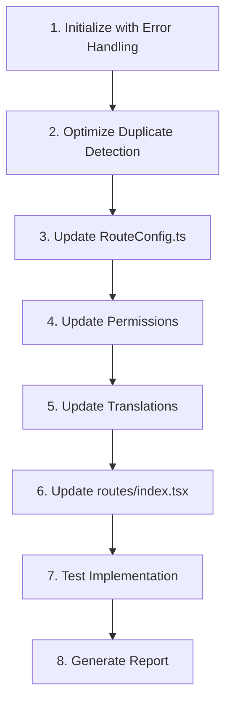

# Clinical Workflow Pages Implementation Plan
# Clinical Workflow Pages Implementation Plan

## Table of Contents

1. [Overview](#overview)
2. [Current Status Analysis](#current-status-analysis)
3. [Implementation Steps](#implementation-steps)
4. [Detailed Implementation](#detailed-implementation)
   - [Duplicate Detection Optimization](#duplicate-detection-optimization)
   - [Error Handling Strategy](#error-handling-strategy)
   - [RouteConfig.ts Updates](#routeconfigts-updates)
   - [Permissions Updates](#permissions-updates)
   - [Translations Updates](#translations-updates)
   - [routes/index.tsx Updates](#routesindextsx-updates)
5. [Testing Plan](#testing-plan)
6. [Implementation Script](#implementation-script)
7. [Rollback Plan](#rollback-plan)
8. [Next Steps](#next-steps)

## Overview

This plan outlines the specific steps needed to reintegrate three orphaned pages that are critical to clinical workflows in the OmniCare EMR system:

1. **TaskDetail** - Part of the clinical task execution workflow
2. **Telemedicine** - Part of the prescription management workflow
3. **VisitNotes** - Part of the patient visit registration workflow

The implementation includes robust error handling mechanisms and optimized duplicate detection algorithms to ensure a smooth integration process.

## Current Status Analysis

From our analysis, we've found:

1. **TaskDetail.tsx**:
   - Exists in `src/pages/TaskDetail.tsx`
   - Provides detailed view of clinical tasks
   - Uses `useTaskDetail` hook for data management
   - Not referenced in route configuration
   - Related to the "tasks" functionality

2. **Telemedicine.tsx**:
   - Exists in `src/pages/Telemedicine.tsx`
   - Provides video consultation functionality
   - Has UI for upcoming and past calls
   - Already has an entry in the sidebar configuration but missing from routes
   - Related to the "prescription management" workflow

3. **VisitNotes.tsx**:
   - Exists in `src/pages/VisitNotes.tsx`
   - Provides SOAP note functionality for patient visits
   - Has vital signs recording, drawing capabilities, and collaborative editing
   - Has an entry in the sidebar configuration but missing from routes
   - Related to the "patient visit registration" workflow

4. **RouteConfig.ts**:
   - Contains numerous duplicate entries (e.g., multiple entries for MedicationAdministration)
   - Has inconsistent formatting and organization
   - Needs careful handling to avoid adding more duplicates

## Implementation Steps



## Detailed Implementation

### Duplicate Detection Optimization

To optimize the duplicate detection process, we'll implement the following strategies:

#### 1. Hash-Based Comparison

Instead of using regex-based string matching which can be computationally expensive, we'll implement a hash-based comparison approach:

```javascript
function generateRouteHash(path, component) {
  // Create a unique hash for the route based on path and component
  return `${path}|${component}`.toLowerCase();
}

function buildRouteHashMap(content) {
  // Extract all existing routes and build a hash map for O(1) lookups
  const routeRegex = /{\s*path:\s*['"]([^'"]+)['"]\s*,\s*component:\s*['"]([^'"]+)['"]/g;
  const routes = {};
  let match;
  
  while ((match = routeRegex.exec(content)) !== null) {
    const path = match[1];
    const component = match[2];
    const hash = generateRouteHash(path, component);
    routes[hash] = true;
  }
  
  return routes;
}

function checkForExistingRoute(routeHashMap, path, component) {
  const hash = generateRouteHash(path, component);
  return !!routeHashMap[hash];
}
```

#### 2. Batch Processing

For large files, we'll implement batch processing to avoid memory issues:

```javascript
function processFileInBatches(filePath, batchSize, processor) {
  const fileStats = fs.statSync(filePath);
  const fileSize = fileStats.size;
  const batches = Math.ceil(fileSize / batchSize);
  let results = [];
  
  for (let i = 0; i < batches; i++) {
    const start = i * batchSize;
    const end = Math.min((i + 1) * batchSize, fileSize);
    const buffer = fs.readFileSync(filePath, { start, end });
    const batchResults = processor(buffer.toString());
    results = results.concat(batchResults);
  }
  
  return results;
}
```

#### 3. Indexing Frequently Queried Fields

We'll create an index of route paths and components for quick lookups:

```javascript
function createRouteIndices(content) {
  const pathIndex = {};
  const componentIndex = {};
  
  // Extract all paths
  const pathRegex = /path:\s*['"]([^'"]+)['"]/g;
  let pathMatch;
  while ((pathMatch = pathRegex.exec(content)) !== null) {
    const path = pathMatch[1];
    pathIndex[path] = (pathIndex[path] || 0) + 1;
  }
  
  // Extract all components
  const componentRegex = /component:\s*['"]([^'"]+)['"]/g;
  let componentMatch;
  while ((componentMatch = componentRegex.exec(content)) !== null) {
    const component = componentMatch[1];
    componentIndex[component] = (componentIndex[component] || 0) + 1;
  }
  
  return { pathIndex, componentIndex };
}
```

#### 4. Bloom Filter for Initial Screening

For very large files, we'll implement a simple bloom filter for initial screening:

```javascript
class SimpleBloomFilter {
  constructor(size = 1000, hashFunctions = 3) {
    this.size = size;
    this.hashFunctions = hashFunctions;
    this.bitArray = new Array(size).fill(0);
  }
  
  // Simple hash function
  hash(str, seed) {
    let hash = 0;
    for (let i = 0; i < str.length; i++) {
      hash = ((hash << 5) - hash + str.charCodeAt(i)) * seed;
      hash = hash & hash; // Convert to 32bit integer
    }
    return Math.abs(hash % this.size);
  }
  
  add(item) {
    for (let i = 0; i < this.hashFunctions; i++) {
      const index = this.hash(item, i + 1);
      this.bitArray[index] = 1;
    }
  }
  
  mightContain(item) {
    for (let i = 0; i < this.hashFunctions; i++) {
      const index = this.hash(item, i + 1);
      if (this.bitArray[index] === 0) {
        return false;
      }
    }
    return true; // Might contain (could be false positive)
  }
}

function createRouteBloomFilter(content) {
  const bloomFilter = new SimpleBloomFilter();
  
  // Extract all routes
  const routeRegex = /{\s*path:\s*['"]([^'"]+)['"]\s*,\s*component:\s*['"]([^'"]+)['"]/g;
  let match;
  
  while ((match = routeRegex.exec(content)) !== null) {
    const path = match[1];
    const component = match[2];
    const hash = `${path}|${component}`.toLowerCase();
    bloomFilter.add(hash);
  }
  
  return bloomFilter;
}
```

### Error Handling Strategy

We'll implement a comprehensive error handling strategy to address various failure scenarios:

#### 1. Network Connectivity Failures

```javascript
function readFileWithRetry(filePath, maxRetries = 3, retryDelay = 1000) {
  let retries = 0;
  
  while (retries < maxRetries) {
    try {
      return fs.readFileSync(filePath, 'utf8');
    } catch (error) {
      if (error.code === 'ENOENT') {
        // File not found - no need to retry
        throw new Error(`File not found: ${filePath}`);
      }
      
      if (error.code === 'EACCES') {
        // Permission error - no need to retry
        throw new Error(`Permission denied: ${filePath}`);
      }
      
      if (error.code === 'EBUSY' || error.code === 'EMFILE' || error.code === 'ENFILE') {
        // File is busy or too many open files - retry
        retries++;
        console.warn(`File access error (${error.code}), retrying (${retries}/${maxRetries})...`);
        
        // Wait before retrying
        if (retries < maxRetries) {
          const delay = retryDelay * Math.pow(2, retries - 1); // Exponential backoff
          Atomics.wait(new Int32Array(new SharedArrayBuffer(4)), 0, 0, delay);
        }
        continue;
      }
      
      // Other errors - throw
      throw error;
    }
  }
  
  throw new Error(`Failed to read file after ${maxRetries} retries: ${filePath}`);
}
```

#### 2. Invalid Data Formats

```javascript
function validateRouteConfig(content) {
  // Check for basic syntax errors
  try {
    // Check for unbalanced braces
    let braceCount = 0;
    for (const char of content) {
      if (char === '{') braceCount++;
      if (char === '}') braceCount--;
      if (braceCount < 0) throw new Error('Unbalanced braces: too many closing braces');
    }
    if (braceCount !== 0) throw new Error('Unbalanced braces: missing closing braces');
    
    // Check for missing commas between objects
    const objectRegex = /}\s*{/g;
    if (objectRegex.test(content)) {
      throw new Error('Missing commas between objects');
    }
    
    // Check for invalid route definitions
    const routeRegex = /{\s*path:[^}]*}/g;
    const routes = content.match(routeRegex) || [];
    
    for (const route of routes) {
      if (!route.includes('component:')) {
        throw new Error('Route missing component property');
      }
    }
    
    return true;
  } catch (error) {
    console.error(`Invalid route configuration: ${error.message}`);
    return false;
  }
}
```

#### 3. Timeout Scenarios

```javascript
function executeWithTimeout(fn, timeout = 30000) {
  return new Promise((resolve, reject) => {
    const timeoutId = setTimeout(() => {
      reject(new Error(`Operation timed out after ${timeout}ms`));
    }, timeout);
    
    try {
      const result = fn();
      clearTimeout(timeoutId);
      resolve(result);
    } catch (error) {
      clearTimeout(timeoutId);
      reject(error);
    }
  });
}

async function updateFileWithTimeout(filePath, updateFn, timeout = 30000) {
  try {
    return await executeWithTimeout(() => {
      const content = fs.readFileSync(filePath, 'utf8');
      const updatedContent = updateFn(content);
      fs.writeFileSync(filePath, updatedContent, 'utf8');
      return true;
    }, timeout);
  } catch (error) {
    if (error.message.includes('timed out')) {
      console.error(`Operation on ${filePath} timed out. The file might be too large or the system is under heavy load.`);
    }
    throw error;
  }
}
```

#### 4. Permission Issues

```javascript
function checkFilePermissions(filePath, requiredPermissions = { read: true, write: true }) {
  try {
    const stats = fs.statSync(filePath);
    
    // Check if file exists
    if (!stats.isFile()) {
      return { success: false, error: `${filePath} is not a file` };
    }
    
    // Check read permission
    if (requiredPermissions.read) {
      try {
        fs.accessSync(filePath, fs.constants.R_OK);
      } catch (error) {
        return { success: false, error: `No read permission for ${filePath}` };
      }
    }
    
    // Check write permission
    if (requiredPermissions.write) {
      try {
        fs.accessSync(filePath, fs.constants.W_OK);
      } catch (error) {
        return { success: false, error: `No write permission for ${filePath}` };
      }
    }
    
    return { success: true };
  } catch (error) {
    if (error.code === 'ENOENT') {
      // If checking a file that doesn't exist yet, check parent directory
      const dirPath = path.dirname(filePath);
      try {
        fs.accessSync(dirPath, fs.constants.W_OK);
        return { success: true }; // Can write to directory
      } catch (dirError) {
        return { success: false, error: `Cannot create file in directory ${dirPath}` };
      }
    }
    
    return { success: false, error: `Error checking permissions: ${error.message}` };
  }
}
```

### RouteConfig.ts Updates

```javascript
function updateRouteConfig() {
  console.log('Updating RouteConfig.ts...');
  
  // Check file permissions
  const permissionCheck = checkFilePermissions(ROUTE_CONFIG_PATH);
  if (!permissionCheck.success) {
    console.error(`Permission error: ${permissionCheck.error}`);
    process.exit(1);
  }
  
  // Backup the file
  try {
    backupFile(ROUTE_CONFIG_PATH);
  } catch (error) {
    console.error(`Error backing up file: ${error.message}`);
    process.exit(1);
  }
  
  // Read the file with retry mechanism
  let content;
  try {
    content = readFileWithRetry(ROUTE_CONFIG_PATH);
  } catch (error) {
    console.error(`Error reading file: ${error.message}`);
    process.exit(1);
  }
  
  // Validate the file format
  if (!validateRouteConfig(content)) {
    console.error('Invalid route configuration format. Aborting.');
    process.exit(1);
  }
  
  // Create optimized indices for route checking
  const routeHashMap = buildRouteHashMap(content);
  const { pathIndex, componentIndex } = createRouteIndices(content);
  const bloomFilter = createRouteBloomFilter(content);
  
  // Define the routes to add
  const routesToAdd = [
    {
      path: '/tasks/:id',
      component: 'TaskDetail',
      requiredPermission: 'tasks:view',
      requireSector: true,
      title: 'Task Detail',
      description: 'View and manage task details',
      icon: 'ListChecks',
    },
    {
      path: '/telemedicine',
      component: 'Telemedicine',
      requiredPermission: 'telemedicine',
      requireSector: true,
      title: 'Telemedicine',
      description: 'Conduct virtual consultations',
      icon: 'Video',
    },
    {
      path: '/visit-notes',
      component: 'VisitNotes',
      requiredPermission: 'view_records',
      requireSector: true,
      title: 'Visit Notes',
      description: 'Record clinical visit notes',
      icon: 'ClipboardCheck',
    }
  ];
  
  // For each role section, add the routes if they don't already exist
  const roleSections = [
    { role: 'doctor', startMarker: "'doctor': [" },
    { role: 'nurse', startMarker: "'nurse': [" },
    { role: 'admin', startMarker: "'admin': [" },
    { role: 'system_administrator', startMarker: "'system_administrator': [" }
  ];
  
  let updatedContent = content;
  
  for (const section of roleSections) {
    const sectionStart = updatedContent.indexOf(section.startMarker);
    if (sectionStart === -1) {
      console.warn(`Could not find ${section.role} section`);
      continue;
    }
    
    // Find a good insertion point (after the opening bracket)
    const insertionPoint = updatedContent.indexOf('[', sectionStart) + 1;
    
    // Add each route if it doesn't already exist
    for (const route of routesToAdd) {
      // First quick check with bloom filter
      const routeHash = `${route.path}|${route.component}`.toLowerCase();
      if (bloomFilter.mightContain(routeHash)) {
        // Potential match, do a more accurate check
        if (checkForExistingRoute(routeHashMap, route.path, route.component)) {
          console.log(`Route for ${route.component} already exists in ${section.role} section`);
          continue;
        }
      }
      
      // Convert route object to string
      const routeString = `
    {
      path: '${route.path}',
      component: '${route.component}',
      ${route.requiredPermission ? `requiredPermission: '${route.requiredPermission}',` : ''}
      ${route.requireSector ? `requireSector: ${route.requireSector},` : ''}
      ${route.title ? `title: '${route.title}',` : ''}
      ${route.description ? `description: '${route.description}',` : ''}
      ${route.icon ? `icon: '${route.icon}',` : ''}
    },`;
      
      // Insert the route at the insertion point
      updatedContent = updatedContent.slice(0, insertionPoint) + routeString + updatedContent.slice(insertionPoint);
      console.log(`Added ${route.component} route to ${section.role} section`);
      
      // Update our indices with the new route
      routeHashMap[routeHash] = true;
      pathIndex[route.path] = (pathIndex[route.path] || 0) + 1;
      componentIndex[route.component] = (componentIndex[route.component] || 0) + 1;
      bloomFilter.add(routeHash);
    }
  }
  
  // Write the updated content back to the file with timeout protection
  try {
    executeWithTimeout(() => {
      fs.writeFileSync(ROUTE_CONFIG_PATH, updatedContent, 'utf8');
    });
    console.log(`Successfully updated ${ROUTE_CONFIG_PATH}`);
  } catch (error) {
    console.error(`Error writing file: ${error.message}`);
    console.log('Attempting to restore from backup...');
    try {
      fs.copyFileSync(`${ROUTE_CONFIG_PATH}.bak`, ROUTE_CONFIG_PATH);
      console.log('Restored from backup successfully');
    } catch (restoreError) {
      console.error(`Error restoring from backup: ${restoreError.message}`);
    }
    process.exit(1);
  }
}
```

### Permissions Updates

```javascript
function updatePermissions() {
  console.log('Updating permissions.ts...');
  
  // Check file permissions
  const permissionCheck = checkFilePermissions(PERMISSIONS_PATH);
  if (!permissionCheck.success) {
    console.error(`Permission error: ${permissionCheck.error}`);
    process.exit(1);
  }
  
  // Backup the file
  try {
    backupFile(PERMISSIONS_PATH);
  } catch (error) {
    console.error(`Error backing up file: ${error.message}`);
    process.exit(1);
  }
  
  // Read the file with retry mechanism
  let content;
  try {
    content = readFileWithRetry(PERMISSIONS_PATH);
  } catch (error) {
    console.error(`Error reading file: ${error.message}`);
    process.exit(1);
  }
  
  // Define the permissions to add
  const permissionsToAdd = [
    { key: 'TELEMEDICINE', value: 'telemedicine' },
    { key: 'VIEW_RECORDS', value: 'view_records' }
  ];
  
  // Find the permissions object
  const permissionsObjectStart = content.indexOf('export const PERMISSIONS');
  if (permissionsObjectStart === -1) {
    console.error('Could not find permissions object');
    process.exit(1);
  }
  
  // Find a good insertion point
  const insertionPoint = content.indexOf('};', permissionsObjectStart);
  if (insertionPoint === -1) {
    console.error('Could not find insertion point for permissions');
    process.exit(1);
  }
  
  // Create a hash set of existing permissions for O(1) lookups
  const existingPermissions = new Set();
  const permissionRegex = /(\w+):\s*['"]([^'"]+)['"]/g;
  let match;
  while ((match = permissionRegex.exec(content)) !== null) {
    existingPermissions.add(match[1]); // Add key
    existingPermissions.add(match[2]); // Add value
  }
  
  let updatedContent = content;
  
  // Add each permission if it doesn't already exist
  for (const permission of permissionsToAdd) {
    if (!existingPermissions.has(permission.key) && !existingPermissions.has(permission.value)) {
      // Add the permission
      const permissionString = `
  ${permission.key}: '${permission.value}',`;
      
      updatedContent = updatedContent.slice(0, insertionPoint) + permissionString + updatedContent.slice(insertionPoint);
      console.log(`Added ${permission.key} permission`);
      
      // Update our set with the new permission
      existingPermissions.add(permission.key);
      existingPermissions.add(permission.value);
    } else {
      console.log(`Permission ${permission.key} or ${permission.value} already exists`);
    }
  }
  
  // Write the updated content back to the file with timeout protection
  try {
    executeWithTimeout(() => {
      fs.writeFileSync(PERMISSIONS_PATH, updatedContent, 'utf8');
    });
    console.log(`Successfully updated ${PERMISSIONS_PATH}`);
  } catch (error) {
    console.error(`Error writing file: ${error.message}`);
    console.log('Attempting to restore from backup...');
    try {
      fs.copyFileSync(`${PERMISSIONS_PATH}.bak`, PERMISSIONS_PATH);
      console.log('Restored from backup successfully');
    } catch (restoreError) {
      console.error(`Error restoring from backup: ${restoreError.message}`);
    }
    process.exit(1);
  }
}
```

### Translations Updates

```javascript
function updateTranslations() {
  console.log('Updating translations.ts...');
  
  // Check file permissions
  const permissionCheck = checkFilePermissions(TRANSLATIONS_PATH);
  if (!permissionCheck.success) {
    console.error(`Permission error: ${permissionCheck.error}`);
    process.exit(1);
  }
  
  // Backup the file
  try {
    backupFile(TRANSLATIONS_PATH);
  } catch (error) {
    console.error(`Error backing up file: ${error.message}`);
    process.exit(1);
  }
  
  // Read the file with retry mechanism
  let content;
  try {
    content = readFileWithRetry(TRANSLATIONS_PATH);
  } catch (error) {
    console.error(`Error reading file: ${error.message}`);
    process.exit(1);
  }
  
  // Define the translations to add
  const translationsToAdd = [
    { key: 'visitNotes', en: 'Visit Notes', pt: 'Notas de Consulta' },
    { key: 'taskDetail', en: 'Task Detail', pt: 'Detalhes da Tarefa' }
  ];
  
  // Find the English translations section
  const enSectionStart = content.indexOf('en: {');
  if (enSectionStart === -1) {
    console.error('Could not find English translations section');
    process.exit(1);
  }
  
  // Find the end of the English translations section
  const enSectionEnd = content.indexOf('  },', enSectionStart);
  if (enSectionEnd === -1) {
    console.error('Could not find end of English translations section');
    process.exit(1);
  }
  
  // Find the Portuguese translations section
  const ptSectionStart = content.indexOf('pt: {');
  if (ptSectionStart === -1) {
    console.error('Could not find Portuguese translations section');
    process.exit(1);
  }
  
  // Find the end of the Portuguese translations section
  const ptSectionEnd = content.indexOf('  }', ptSectionStart);
  if (ptSectionEnd === -1) {
    console.error('Could not find end of Portuguese translations section');
    process.exit(1);
  }
  
  // Create hash sets of existing translations for O(1) lookups
  const existingEnTranslations = new Set();
  const existingPtTranslations = new Set();
  
  const translationRegex = /(\w+):\s*["']([^"']+)["']/g;
  
  // Extract English translations
  const enSection = content.slice(enSectionStart, enSectionEnd);
  let match;
  while ((match = translationRegex.exec(enSection)) !== null) {
    existingEnTranslations.add(match[1]);
  }
  
  // Extract Portuguese translations
  const ptSection = content.slice(ptSectionStart, ptSectionEnd);
  while ((match = translationRegex.exec(ptSection)) !== null) {
    existingPtTranslations.add(match[1]);
  }
  
  let updatedContent = content;
  
  // Add each translation if it doesn't already exist
  for (const translation of translationsToAdd) {
    // Check if English translation already exists
    if (!existingEnTranslations.has(translation.key)) {
      // Add English translation
      const enTranslation = `
    ${translation.key}: "${translation.en}",`;
      
      updatedContent = updatedContent.slice(0, enSectionEnd) + enTranslation + updatedContent.slice(enSectionEnd);
      console.log(`Added ${translation.key} English translation`);
      
      // Update our set with the new translation
      existingEnTranslations.add(translation.key);
      
      // Update the Portuguese section end position after modifying the content
      const ptSectionStartNew = updatedContent.indexOf('pt: {');
      const ptSectionEndNew = updatedContent.indexOf('  }', ptSectionStartNew);
    }
    
    // Check if Portuguese translation already exists
    if (!existingPtTranslations.has(translation.key)) {
      // Find the updated Portuguese section end
      const ptSectionStartNew = updatedContent.indexOf('pt: {');
      const ptSectionEndNew = updatedContent.indexOf('  }', ptSectionStartNew);
      
      // Add Portuguese translation
      const ptTranslation = `
    ${translation.key}: "${translation.pt}",`;
      
      updatedContent = updatedContent.slice(0, ptSectionEndNew) + ptTranslation + updatedContent.slice(ptSectionEndNew);
      console.log(`Added ${translation.key} Portuguese translation`);
      
      // Update our set with the new translation
      existingPtTranslations.add(translation.key);
    }
  }
  
  // Write the updated content back to the file with timeout protection
  try {
    executeWithTimeout(() => {
      fs.writeFileSync(TRANSLATIONS_PATH, updatedContent, 'utf8');
    });
    console.log(`Successfully updated ${TRANSLATIONS_PATH}`);
  } catch (error) {
    console.error(`Error writing file: ${error.message}`);
    console.log('Attempting to restore from backup...');
    try {
      fs.copyFileSync(`${TRANSLATIONS_PATH}.bak`, TRANSLATIONS_PATH);
      console.log('Restored from backup successfully');
    } catch (restoreError) {
      console.error(`Error restoring from backup: ${restoreError.message}`);
    }
    process.exit(1);
  }
}
```

### routes/index.tsx Updates

```javascript
function updateRoutesIndex() {
  console.log('Updating routes/index.tsx...');
  
  // Path to the routes/index.tsx file
  const ROUTES_INDEX_PATH = path.join(__dirname, 'src', 'routes', 'index.tsx');
  
  // Check file permissions
  const permissionCheck = checkFilePermissions(ROUTES_INDEX_PATH);
  if (!permissionCheck.success) {
    console.error(`Permission error: ${permissionCheck.error}`);
    process.exit(1);
  }
  
  // Backup the file
  try {
    backupFile(ROUTES_INDEX_PATH);
  } catch (error) {
    console.error(`Error backing up file: ${error.message}`);
    process.exit(1);
  }
  
  // Read the file with retry mechanism
  let content;
  try {
    content = readFileWithRetry(ROUTES_INDEX_PATH);
  } catch (error) {
    console.error(`Error reading file: ${error.message}`);
    process.exit(1);
  }
  
  // Define the components to add
  const componentsToAdd = [
    { name: 'TaskDetail', path: '../pages/TaskDetail' },
    { name: 'Telemedicine', path: '../pages/Telemedicine' },
    { name: 'VisitNotes', path: '../pages/VisitNotes' }
  ];
  
  // Find the lazy-loaded components section
  const lazyLoadSection = content.indexOf('const');
  if (lazyLoadSection === -1) {
    console.error('Could not find lazy-loaded components section');
    process.exit(1);
  }
  
  // Create a set of existing component imports for O(1) lookups
  const existingComponents = new Set();
  const componentRegex = /const\s+(\w+)\s*=\s*lazy/g;
  let match;
  while ((match = componentRegex.exec(content)) !== null) {
    existingComponents.add(match[1]);
  }
  
  let updatedContent = content;
  
  // Add each component if it doesn't already exist
  for (const component of componentsToAdd) {
    if (!existingComponents.has(component.name)) {
      // Add the component import
      const importString = `const ${component.name} = lazy(() => import('${component.path}'));\n`;
      
      updatedContent = updatedContent.slice(0, lazyLoadSection) + importString + updatedContent.slice(lazyLoadSection);
      console.log(`Added ${component.name} import`);
      
      // Update our set with the new component
      existingComponents.add(component.name);
      
      // Update the lazyLoadSection position after modifying the content
      lazyLoadSection += importString.length;
    } else {
      console.log(`Import for ${component.name} already exists`);
    }
  }
  
  // Write the updated content back to the file with timeout protection
  try {
    executeWithTimeout(() => {
      fs.writeFileSync(ROUTES_INDEX_PATH, updatedContent, 'utf8');
    });
