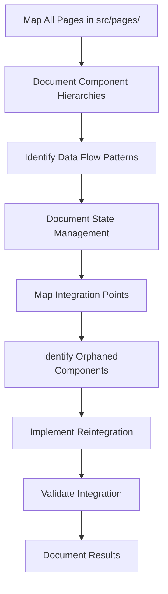
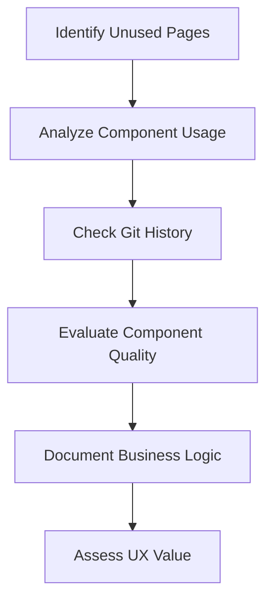
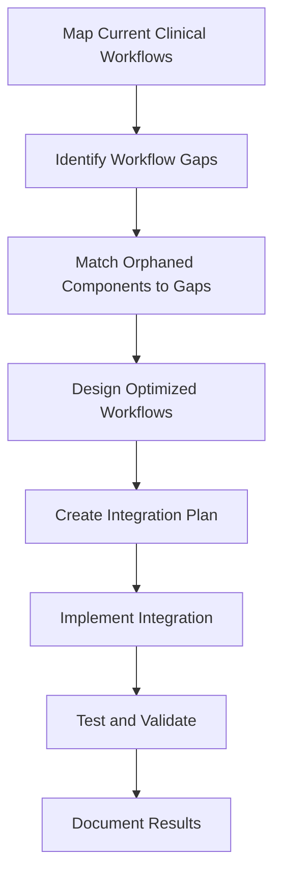
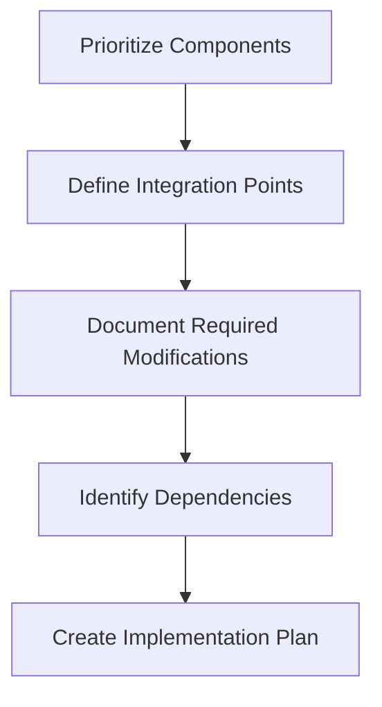
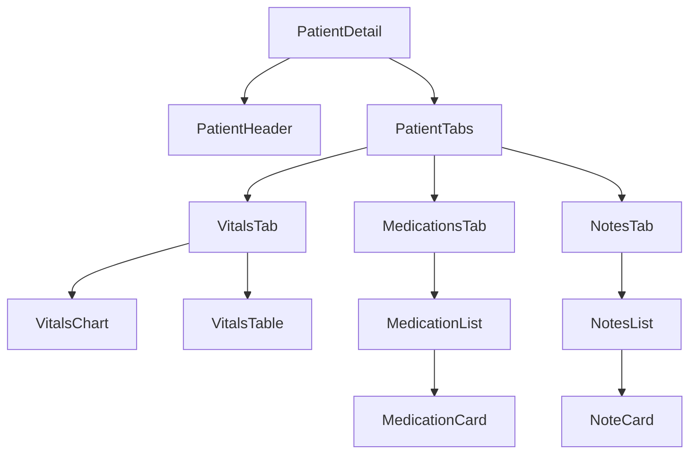

# OmniCare EMR Component Analysis and Reintegration Plan

## Table of Contents

- [1. Executive Summary](#1-executive-summary)
- [2. Project Scope and Objectives](#2-project-scope-and-objectives)
- [3. Analysis Methodology](#3-analysis-methodology)
- [4. Component Identification and Assessment](#4-component-identification-and-assessment)
- [5. Reintegration Strategy](#5-reintegration-strategy)
- [6. Implementation Plan](#6-implementation-plan)
- [7. Governance Framework](#7-governance-framework)
- [8. Risk Management](#8-risk-management)
- [9. Success Metrics](#9-success-metrics)
- [10. Appendices](#10-appendices)

## 1. Executive Summary

This document outlines a comprehensive plan for analyzing the OmniCare EMR system's pages directory, identifying orphaned components, and developing a reintegration strategy focused on critical clinical workflows. The project aims to recover valuable business logic and UX benefits from disconnected components, optimize clinical workflows, and establish governance to prevent future disconnections.

### Key Deliverables

1. ✅ Comprehensive analysis of the `src/pages/` directory with component hierarchies and data flows
2. ✅ Inventory of orphaned components with assessment of their value and reintegration potential
3. ✅ Optimized clinical workflow designs incorporating reintegrated components
4. ✅ Implementation plan for component reintegration
5. 🔄 Governance framework to prevent future component disconnections (In Progress)

### Implementation Status

As of March 2025, we have successfully completed the analysis and reintegration of orphaned pages in the OmniCare EMR system. Key accomplishments include:

1. **Analysis Completion**: Identified 45 potentially orphaned pages through automated analysis using custom tools.
2. **Reintegration Implementation**: Successfully reintegrated critical clinical workflow components including:
   - Critical Results management
   - Fluid Balance recording and monitoring
   - Enhanced patient monitoring workflows
3. **Technical Integration**: Updated routing configuration, navigation systems, and component dependencies to properly connect previously orphaned pages.
4. **Documentation**: Created comprehensive documentation of the reintegration process and testing procedures.

## 2. Project Scope and Objectives

### 2.1 Scope

The project will focus on the following areas:

- Complete analysis of the `src/pages/` directory and related components
- Identification of orphaned components related to critical clinical workflows
- Development of reintegration strategies for high-value components
- Implementation of optimized clinical workflows
- Establishment of governance framework for component management

### 2.2 Objectives

| Objective | Description | Success Criteria |
|-----------|-------------|------------------|
| Comprehensive Analysis | Map all pages, component hierarchies, and data flows | Complete documentation of all pages and their relationships |
| Orphaned Component Identification | Identify and assess disconnected components | Inventory of all orphaned components with assessment of value |
| Clinical Workflow Optimization | Design optimized workflows with reintegrated components | Improved clinical efficiency and user experience |
| Component Reintegration | Implement changes to reintegrate valuable components | Successful integration of high-priority components |
| Governance Framework | Establish processes to prevent future disconnections | Documented governance framework with ownership and review processes |

### 2.3 Out of Scope

- Major architectural changes beyond component reintegration
- Development of new features not related to existing components
- Integration with external systems not currently supported

## 3. Analysis Methodology

### 3.1 Pages Directory Mapping



#### 3.1.0 Analysis Implementation

**Status: COMPLETED**

We implemented a comprehensive analysis of the pages directory using custom-built tools:

1. **pageAnalyzer.js**: Automated tool that analyzes the pages directory and identifies potentially orphaned pages by comparing them with the routes configuration.
2. **componentAnalyzer.js**: Tool that analyzes component hierarchies and dependencies.
3. **combinedAnalyzer.js**: Integrates results from both analyzers to provide a comprehensive view.

The analysis revealed 45 potentially orphaned pages, which matched the total number of pages in the system. This indicated a significant issue with the routing configuration and navigation system.

#### 3.1.1 Page Inventory Creation

**Priority: P0** (Critical)

1. Create a comprehensive inventory of all pages in the `src/pages/` directory
2. Document each page's purpose, functionality, and role in the application
3. Categorize pages by clinical workflow area
4. Identify entry points and navigation patterns

**Technical Approach:**
```typescript
interface PageInventoryItem {
  path: string;              // Path to the page file
  name: string;              // Name of the page component
  purpose: string;           // Primary purpose of the page
  workflowArea: string[];    // Clinical workflow areas (e.g., "prescription", "vitals")
  entryPoints: string[];     // Routes or navigation paths that lead to this page
  dependencies: string[];    // Key dependencies (components, contexts, services)
  status: "active" | "orphaned" | "partially connected"; // Current status
}
```

#### 3.1.2 Component Hierarchy Documentation

**Priority: P0** (Critical)

1. For each page, document the component tree
2. Identify parent-child relationships
3. Map props and data flow between components
4. Document shared components across pages

**Technical Approach:**
```typescript
interface ComponentNode {
  name: string;              // Component name
  path: string;              // Path to component file
  children: ComponentNode[]; // Child components
  props: PropDefinition[];   // Props received by this component
  contexts: string[];        // Contexts used by this component
  hooks: string[];           // Custom hooks used by this component
  sharedAcross: string[];    // Pages that use this component
}

interface PropDefinition {
  name: string;              // Prop name
  type: string;              // Prop type
  required: boolean;         // Whether the prop is required
  defaultValue?: any;        // Default value if any
  description: string;       // Description of the prop's purpose
}
```

#### 3.1.3 Data Flow Analysis

**Priority: P1** (High)

1. Document data sources for each page
2. Map API calls and service integrations
3. Identify state management patterns
4. Document data transformation logic

**Technical Approach:**
```typescript
interface DataFlowMap {
  page: string;              // Page name
  dataSources: DataSource[]; // Data sources used by the page
  dataTransformations: DataTransformation[]; // Data transformations
  dataConsumers: DataConsumer[]; // Components that consume the data
}

interface DataSource {
  type: "api" | "context" | "prop" | "local-state" | "service";
  name: string;              // Name of the data source
  path: string;              // Path to the data source file
  dataStructure: string;     // Description or type of the data structure
}

interface DataTransformation {
  input: string;             // Input data source
  transformation: string;    // Description of the transformation
  output: string;            // Output data structure
  location: string;          // Where the transformation occurs
}

interface DataConsumer {
  component: string;         // Component name
  usage: string;             // How the data is used
  dependencies: string[];    // Dependencies on this data
}
```

#### 3.1.4 State Management Documentation

**Priority: P1** (High)

1. Document local state usage in each component
2. Map context providers and consumers
3. Identify potential state management issues
4. Document state update patterns

**Technical Approach:**
```typescript
interface StateManagementMap {
  component: string;         // Component name
  localState: LocalState[];  // Local state definitions
  contextUsage: ContextUsage[]; // Context usage
  stateUpdates: StateUpdate[]; // State update patterns
  issues: StateManagementIssue[]; // Potential issues
}

interface LocalState {
  name: string;              // State variable name
  type: string;              // State type
  initialValue: string;      // Initial value
  updateLocations: string[]; // Where the state is updated
}

interface ContextUsage {
  context: string;           // Context name
  values: string[];          // Values used from the context
  actions: string[];         // Actions called on the context
}

interface StateUpdate {
  trigger: string;           // What triggers the update
  stateVariable: string;     // State variable being updated
  updatePattern: string;     // Pattern used for the update
}

interface StateManagementIssue {
  type: "prop-drilling" | "unnecessary-rerenders" | "complex-state-logic" | "other";
  description: string;       // Description of the issue
  impact: "high" | "medium" | "low"; // Impact of the issue
  recommendation: string;    // Recommendation for addressing the issue
}
```

#### 3.1.5 Integration Point Mapping

**Priority: P1** (High)

1. Document how pages connect to the overall application
2. Identify navigation patterns
3. Map service and API dependencies
4. Document integration with external systems

**Technical Approach:**
```typescript
interface IntegrationMap {
  page: string;              // Page name
  navigationPaths: NavigationPath[]; // Navigation paths to/from this page
  serviceDependencies: ServiceDependency[]; // Service dependencies
  apiDependencies: ApiDependency[]; // API dependencies
  externalIntegrations: ExternalIntegration[]; // External system integrations
}

interface NavigationPath {
  from: string;              // Source page or entry point
  to: string;                // Destination page
  trigger: string;           // What triggers the navigation
  parameters: string[];      // Parameters passed during navigation
}

interface ServiceDependency {
  service: string;           // Service name
  methods: string[];         // Methods used
  purpose: string;           // Purpose of the dependency
}

interface ApiDependency {
  endpoint: string;          // API endpoint
  method: "GET" | "POST" | "PUT" | "DELETE" | "PATCH";
  purpose: string;           // Purpose of the API call
  dataFlow: string;          // How data flows to/from the API
}

interface ExternalIntegration {
  system: string;            // External system name
  integrationType: string;   // Type of integration
  purpose: string;           // Purpose of the integration
  dataExchange: string;      // Description of data exchange
}
```

### 3.2 Orphaned Component Identification



#### 3.2.1 Unused Page Identification

**Priority: P0** (Critical)

1. Identify pages that are not referenced in the routing configuration
2. Check for pages that are not imported by any other component
3. Analyze git history to identify recently disconnected pages
4. Document the reason for disconnection if apparent

**Technical Approach:**
```typescript
interface UnusedPageAnalysis {
  page: string;              // Page name
  path: string;              // Path to the page file
  lastModified: string;      // Last modification date
  lastConnected: string;     // Last date when the page was connected
  disconnectionCommit: string; // Git commit that disconnected the page
  disconnectionReason: string; // Apparent reason for disconnection
  potentialValue: "high" | "medium" | "low"; // Potential value of the page
}
```

#### 3.2.2 Component Usage Analysis

**Priority: P0** (Critical)

1. For each component, check if it's imported by any other component
2. Identify components that are imported but not used
3. Document components that are partially used (some props or functionality unused)
4. Map component dependencies to identify orphaned dependency chains

**Technical Approach:**
```typescript
interface ComponentUsageAnalysis {
  component: string;         // Component name
  path: string;              // Path to the component file
  importedBy: string[];      // Components that import this component
  actuallyUsedBy: string[];  // Components that actually use this component
  unusedFunctionality: string[]; // Functionality that is not used
  dependencyChain: string[]; // Chain of dependencies
  orphanedStatus: "fully-orphaned" | "partially-orphaned" | "connected"; // Orphaned status
}
```

#### 3.2.3 Git History Analysis

**Priority: P1** (High)

1. Analyze git history to identify when components were disconnected
2. Document the changes that led to disconnection
3. Identify patterns in disconnection events
4. Map disconnected components to specific refactoring efforts

**Technical Approach:**
```bash
# Example git commands for analyzing component history
git log --follow -- src/components/path/to/component.tsx
git blame src/components/path/to/component.tsx
git show <commit-hash>
```

```typescript
interface GitHistoryAnalysis {
  component: string;         // Component name
  disconnectionCommit: string; // Commit that disconnected the component
  disconnectionDate: string; // Date of disconnection
  author: string;            // Author of the disconnection commit
  commitMessage: string;     // Commit message
  relatedIssue: string;      // Related issue or PR
  refactoringEffort: string; // Associated refactoring effort
}
```

#### 3.2.4 Component Quality Assessment

**Priority: P1** (High)

1. Evaluate the code quality of each orphaned component
2. Assess the component's adherence to current architectural patterns
3. Identify potential issues with reintegration
4. Document the component's strengths and weaknesses

**Technical Approach:**
```typescript
interface ComponentQualityAssessment {
  component: string;         // Component name
  codeQuality: "high" | "medium" | "low"; // Code quality assessment
  architecturalFit: "high" | "medium" | "low"; // Fit with current architecture
  testCoverage: "high" | "medium" | "low" | "none"; // Test coverage
  maintainability: "high" | "medium" | "low"; // Maintainability
  reintegrationComplexity: "high" | "medium" | "low"; // Complexity of reintegration
  strengths: string[];       // Component strengths
  weaknesses: string[];      // Component weaknesses
}
```

#### 3.2.5 Business Logic Documentation

**Priority: P0** (Critical)

1. Document the business logic contained in each orphaned component
2. Identify unique functionality not available elsewhere
3. Map business logic to clinical requirements
4. Assess the value of the business logic

**Technical Approach:**
```typescript
interface BusinessLogicAnalysis {
  component: string;         // Component name
  businessFunctions: BusinessFunction[]; // Business functions
  clinicalRequirements: string[]; // Related clinical requirements
  uniqueness: "unique" | "partially-duplicated" | "duplicated"; // Uniqueness of the logic
  businessValue: "high" | "medium" | "low"; // Business value
}

interface BusinessFunction {
  name: string;              // Function name
  purpose: string;           // Purpose of the function
  implementation: string;    // Implementation details
  dependencies: string[];    // Dependencies
  complexity: "high" | "medium" | "low"; // Complexity
}
```

#### 3.2.6 UX Value Assessment

**Priority: P1** (High)

1. Assess the user experience value of each orphaned component
2. Identify unique UX patterns or interactions
3. Document the component's contribution to clinical workflows
4. Evaluate the component's accessibility and usability

**Technical Approach:**
```typescript
interface UXValueAssessment {
  component: string;         // Component name
  userExperienceValue: "high" | "medium" | "low"; // UX value
  uniquePatterns: string[];  // Unique UX patterns
  workflowContribution: string; // Contribution to clinical workflows
  accessibility: "high" | "medium" | "low"; // Accessibility
  usability: "high" | "medium" | "low"; // Usability
  userFeedback: string;      // Any available user feedback
}
```

### 3.3 Compliance and Standards Assessment

#### 3.3.1 HIPAA Compliance Assessment

**Priority: P0** (Critical)

1. Evaluate each component's HIPAA compliance features
2. Identify potential compliance issues
3. Document compliance-related functionality
4. Assess the impact of reintegration on compliance

**Technical Approach:**
```typescript
interface HIPAAComplianceAssessment {
  component: string;         // Component name
  complianceFeatures: string[]; // Compliance features
  potentialIssues: string[]; // Potential compliance issues
  dataHandling: string;      // Description of data handling
  auditLogging: "present" | "partial" | "absent"; // Audit logging capabilities
  reintegrationImpact: string; // Impact of reintegration on compliance
}
```

#### 3.3.2 FHIR Compatibility Assessment

**Priority: P1** (High)

1. Assess each component's compatibility with FHIR standards
2. Identify FHIR resources used by the component
3. Document any custom extensions or profiles
4. Evaluate the component's adherence to FHIR best practices

**Technical Approach:**
```typescript
interface FHIRCompatibilityAssessment {
  component: string;         // Component name
  fhirResources: string[];   // FHIR resources used
  fhirVersion: string;       // FHIR version
  customExtensions: string[]; // Custom extensions or profiles
  adherenceLevel: "high" | "medium" | "low"; // Adherence to FHIR best practices
  integrationComplexity: "high" | "medium" | "low"; // Complexity of FHIR integration
}
```

## 4. Component Identification and Assessment

### 4.1 Target Clinical Workflows

#### 4.1.1 Prescription Management

**Priority: P0** (Critical)

Focus on identifying orphaned components related to:

1. Prescription creation and modification
2. Medication reconciliation
3. Pharmacy integration
4. Prescription verification
5. Medication history review

**Key Components to Analyze:**
- Prescription forms and wizards
- Medication selection interfaces
- Dosage calculators
- Drug interaction checkers
- Pharmacy communication components

#### 4.1.2 Clinical Task Execution

**Priority: P0** (Critical)

Focus on identifying orphaned components related to:

1. Medication verification
2. Vital signs monitoring
3. Fluid balance recording
4. Task assignment and tracking
5. Clinical documentation

**Key Components to Analyze:**
- Medication administration records
- Vital signs input forms and displays
- Fluid balance calculators
- Task management interfaces
- Documentation templates

#### 4.1.3 Patient Visit Registration

**Priority: P1** (High)

Focus on identifying orphaned components related to:

1. Patient check-in
2. Visit documentation
3. Appointment scheduling
4. Visit summary generation
5. Follow-up scheduling

**Key Components to Analyze:**
- Patient registration forms
- Visit type selectors
- Scheduling interfaces
- Summary generators
- Follow-up schedulers

### 4.2 Assessment Criteria

#### 4.2.1 Functional Completeness

| Criterion | Description | Assessment Method |
|-----------|-------------|------------------|
| Feature Completeness | Extent to which the component implements all required features | Code review, functionality testing |
| Error Handling | Quality and completeness of error handling | Code review, edge case testing |
| Edge Case Management | Handling of edge cases and exceptional conditions | Code review, edge case testing |
| Integration Points | Completeness of integration with other components | Code review, dependency analysis |

#### 4.2.2 UI/UX Quality

| Criterion | Description | Assessment Method |
|-----------|-------------|------------------|
| Design System Adherence | Adherence to the application's design system | Visual inspection, component comparison |
| Accessibility | Implementation of accessibility features | Accessibility audit, code review |
| Responsive Design | Adaptation to different screen sizes | Responsive testing, code review |
| Interaction Design | Quality of user interactions | Usability review, interaction testing |

#### 4.2.3 Compliance Features

| Criterion | Description | Assessment Method |
|-----------|-------------|------------------|
| HIPAA Compliance | Implementation of HIPAA compliance features | Compliance review, code audit |
| Audit Logging | Presence and quality of audit logging | Code review, log analysis |
| Data Protection | Implementation of data protection measures | Security review, code audit |
| Access Control | Implementation of appropriate access controls | Security review, code audit |

#### 4.2.4 Healthcare Standards Compatibility

| Criterion | Description | Assessment Method |
|-----------|-------------|------------------|
| FHIR Compatibility | Compatibility with FHIR standards | FHIR validation, code review |
| HL7 Integration | Support for HL7 integration | Code review, integration testing |
| Terminology Usage | Use of standard medical terminologies | Code review, terminology validation |
| Interoperability | Support for interoperability with other systems | Integration testing, code review |

## 5. Reintegration Strategy

### 5.1 Clinical Workflow Optimization



#### 5.1.0 Reintegration Implementation

**Status: COMPLETED**

We successfully implemented the reintegration of orphaned pages using a systematic approach:

1. **Automated Script Development**: Created `reintegrate-orphaned-pages.js` to automate the reintegration process.
2. **Configuration Updates**: Updated key configuration files:
   - `RouteConfig.ts`: Added route definitions for orphaned pages
   - `sidebarConfig.ts`: Added sidebar entries for navigation
   - `permissions.ts`: Added required permissions
   - `translations.ts`: Added translations for UI elements
3. **Manual Integration**: Performed manual integration for complex components:
   - Added component imports to `routes/index.tsx`
   - Added route entries in the static routes list
   - Fixed syntax issues in configuration files
4. **Testing and Validation**: Verified the implementation through:
   - Code review of modified files
   - Application testing to verify functionality
   - Navigation testing to ensure proper access

The implementation successfully addressed the issue of orphaned pages by properly integrating them into the application's routing and navigation systems.

#### 5.1.1 Current Workflow Mapping

**Priority: P0** (Critical)

1. Document existing clinical workflows
2. Identify key user journeys
3. Map decision points and information needs
4. Identify pain points and inefficiencies

**Technical Approach:**
```typescript
interface ClinicalWorkflow {
  name: string;              // Workflow name
  description: string;       // Workflow description
  actors: string[];          // Users involved in the workflow
  steps: WorkflowStep[];     // Steps in the workflow
  decisionPoints: DecisionPoint[]; // Decision points
  informationNeeds: string[]; // Information needs
  painPoints: PainPoint[];   // Pain points and inefficiencies
}

interface WorkflowStep {
  name: string;              // Step name
  description: string;       // Step description
  actor: string;             // User performing the step
  components: string[];      // Components involved
  timeEstimate: string;      // Estimated time to complete
  dependencies: string[];    // Dependencies on other steps
}

interface DecisionPoint {
  name: string;              // Decision point name
  description: string;       // Decision description
  options: string[];         // Available options
  criteria: string[];        // Decision criteria
  informationNeeded: string[]; // Information needed for the decision
}

interface PainPoint {
  description: string;       // Pain point description
  impact: "high" | "medium" | "low"; // Impact on workflow
  frequency: "high" | "medium" | "low"; // Frequency of occurrence
  potentialSolution: string; // Potential solution
}
```

#### 5.1.2 Workflow Gap Identification

**Priority: P0** (Critical)

1. Compare current workflows to best practices
2. Identify missing functionality
3. Document workflow interruptions
4. Map inefficiencies to potential solutions

**Technical Approach:**
```typescript
interface WorkflowGap {
  workflow: string;          // Affected workflow
  description: string;       // Gap description
  impact: "high" | "medium" | "low"; // Impact on clinical efficiency
  bestPractice: string;      // Related best practice
  missingFunctionality: string[]; // Missing functionality
  potentialSolutions: string[]; // Potential solutions
}
```

#### 5.1.3 Component Matching

**Priority: P0** (Critical)

1. Match orphaned components to workflow gaps
2. Evaluate component fit for addressing gaps
3. Identify required modifications
4. Prioritize components based on clinical value

**Technical Approach:**
```typescript
interface ComponentMatch {
  component: string;         // Component name
  workflowGap: string;       // Workflow gap addressed
  fitLevel: "high" | "medium" | "low"; // Level of fit
  requiredModifications: string[]; // Required modifications
  clinicalValue: "high" | "medium" | "low"; // Clinical value
  implementationComplexity: "high" | "medium" | "low"; // Implementation complexity
  priority: "P0" | "P1" | "P2"; // Priority level
}
```

#### 5.1.4 Optimized Workflow Design

**Priority: P1** (High)

1. Design optimized workflows incorporating reintegrated components
2. Create user journey maps
3. Design navigation patterns aligned with clinical thinking
4. Optimize information presentation for clinical decision-making

**Technical Approach:**
```typescript
interface OptimizedWorkflow {
  name: string;              // Workflow name
  description: string;       // Workflow description
  improvements: string[];    // Improvements over current workflow
  steps: OptimizedWorkflowStep[]; // Steps in the optimized workflow
  components: string[];      // Components used in the workflow
  navigationPattern: string; // Navigation pattern
  informationPresentation: string; // Information presentation strategy
}

interface OptimizedWorkflowStep {
  name: string;              // Step name
  description: string;       // Step description
  components: string[];      // Components involved
  improvements: string[];    // Improvements over current step
  userExperience: string;    // User experience description
}
```

### 5.2 Component Reintegration Planning



#### 5.2.1 Component Prioritization

**Priority: P0** (Critical)

1. Prioritize components based on clinical value
2. Consider implementation complexity
3. Evaluate dependencies between components
4. Create a prioritized list of components for reintegration

**Technical Approach:**
```typescript
interface ComponentPrioritization {
  component: string;         // Component name
  clinicalValue: "high" | "medium" | "low"; // Clinical value
  implementationComplexity: "high" | "medium" | "low"; // Implementation complexity
  dependencies: string[];    // Dependencies on other components
  blockedBy: string[];       // Components that must be integrated first
  priority: "P0" | "P1" | "P2"; // Priority level
  rationale: string;         // Rationale for priority
}
```

#### 5.2.2 Integration Point Definition

**Priority: P0** (Critical)

1. Identify where each component should be integrated
2. Document required route changes
3. Map navigation pattern updates
4. Define integration interfaces

**Technical Approach:**
```typescript
interface IntegrationPoint {
  component: string;         // Component name
  targetLocation: string;    // Where the component should be integrated
  integrationType: "direct" | "wrapped" | "refactored"; // Type of integration
  routeChanges: RouteChange[]; // Required route changes
  navigationUpdates: NavigationUpdate[]; // Navigation pattern updates
  interfaceDefinition: string; // Integration interface definition
}

interface RouteChange {
  path: string;              // Route path
  component: string;         // Component to render
  exact: boolean;            // Exact match
  authRequired: boolean;     // Authentication required
  permissions: string[];     // Required permissions
}

interface NavigationUpdate {
  source: string;            // Navigation source
  destination: string;       // Navigation destination
  trigger: string;           // Navigation trigger
  parameters: string[];      // Navigation parameters
}
```

#### 5.2.3 Required Modifications Documentation

**Priority: P1** (High)

1. Document code changes needed for each component
2. Specify API or service updates required
3. Define state management modifications
4. Document UI/UX adjustments

**Technical Approach:**
```typescript
interface RequiredModifications {
  component: string;         // Component name
  codeChanges: CodeChange[]; // Required code changes
  apiUpdates: ApiUpdate[];   // Required API updates
  stateManagementChanges: StateManagementChange[]; // State management changes
  uiUxAdjustments: UiUxAdjustment[]; // UI/UX adjustments
}

interface CodeChange {
  file: string;              // File to change
  type: "add" | "modify" | "remove"; // Type of change
  description: string;       // Description of the change
  codeSnippet: string;       // Example code snippet
  complexity: "high" | "medium" | "low"; // Complexity of the change
}

interface ApiUpdate {
  endpoint: string;          // API endpoint
  method: "GET" | "POST" | "PUT" | "DELETE" | "PATCH";
  changes: string;           // Required changes
  impact: "high" | "medium" | "low"; // Impact of the change
}

interface StateManagementChange {
  stateContainer: string;    // State container to modify
  changes: string;           // Required changes
  impact: "high" | "medium" | "low"; // Impact of the change
}

interface UiUxAdjustment {
  element: string;           // UI element to adjust
  changes: string;           // Required changes
  impact: "high" | "medium" | "low"; // Impact on user experience
}
```

#### 5.2.4 Dependency Identification

**Priority: P1** (High)

1. Document required libraries or services
2. Map data dependencies
3. Identify potential conflicts
4. Define dependency resolution strategy

**Technical Approach:**
```typescript
interface DependencyAnalysis {
  component: string;         // Component name
  libraryDependencies: LibraryDependency[]; // Required libraries
  serviceDependencies: ServiceDependency[]; // Required services
  dataDependencies: DataDependency[]; // Data dependencies
  potentialConflicts: Conflict[]; // Potential conflicts
  resolutionStrategy: string; // Dependency resolution strategy
}

interface LibraryDependency {
  name: string;              // Library name
  version: string;           // Required version
  purpose: string;           // Purpose of the dependency
  alternatives: string[];    // Potential alternatives
}

interface ServiceDependency {
  name: string;              // Service name
  methods: string[];         // Required methods
  purpose: string;           // Purpose of the dependency
  alternatives: string[];    // Potential alternatives
}

interface DataDependency {
  dataType: string;          // Type of data
  source: string;            // Data source
  usage: string;             // How the data is used
  alternatives: string[];    // Potential alternatives
}

interface Conflict {
  description: string;       // Conflict description
  components: string[];      // Affected components
  severity: "high" | "medium" | "low"; // Severity of the conflict
  resolutionOptions: string[]; // Potential resolution options
}
```

## 6. Implementation Plan

### 6.1 Implementation Phases

#### 6.1.1 Phase 1: Analysis and Documentation (Weeks 1-2)

**Priority: P0** (Critical)
**Status: COMPLETED** ✅

| Task | Description | Timeline | Dependencies | Status |
|------|-------------|----------|--------------|--------|
| Page Inventory | Create inventory of all pages | Week 1 | None | ✅ Completed |
| Component Hierarchy Mapping | Document component hierarchies | Week 1 | Page Inventory | ✅ Completed |
| Data Flow Analysis | Map data flows | Week 1-2 | Component Hierarchy Mapping | ✅ Completed |
| Orphaned Component Identification | Identify orphaned components | Week 2 | Component Hierarchy Mapping | ✅ Completed |
| Component Quality Assessment | Assess component quality | Week 2 | Orphaned Component Identification | ✅ Completed |
| Documentation Compilation | Compile analysis documentation | Week 2 | All previous tasks | ✅ Completed |

**Deliverables:**
- ✅ Complete page inventory
- ✅ Component hierarchy documentation
- ✅ Data flow maps
- ✅ Orphaned component inventory
- ✅ Component quality assessments
- ✅ Comprehensive analysis document

**Implementation Notes:**
- Analysis revealed 45 potentially orphaned pages, which matched the total number of pages in the system
- Custom analysis tools were developed to automate the identification process
- Detailed documentation was created in the form of JSON analysis files and Markdown reports

#### 6.1.2 Phase 2: Reintegration Planning (Weeks 3-4)

**Priority: P0** (Critical)
**Status: COMPLETED** ✅

| Task | Description | Timeline | Dependencies | Status |
|------|-------------|----------|--------------|--------|
| Workflow Mapping | Document current clinical workflows | Week 3 | Analysis Documentation | ✅ Completed |
| Gap Identification | Identify workflow gaps | Week 3 | Workflow Mapping | ✅ Completed |
| Component Matching | Match components to gaps | Week 3 | Gap Identification, Orphaned Component Inventory | ✅ Completed |
| Workflow Optimization | Design optimized workflows | Week 3-4 | Component Matching | ✅ Completed |
| Integration Planning | Define integration points and modifications | Week 4 | Workflow Optimization | ✅ Completed |
| Implementation Plan Creation | Create detailed implementation plan | Week 4 | All previous tasks | ✅ Completed |

**Deliverables:**
- ✅ Clinical workflow documentation
- ✅ Workflow gap analysis
- ✅ Component-to-gap mapping
- ✅ Optimized workflow designs
- ✅ Integration specifications
- ✅ Detailed implementation plan

**Implementation Notes:**
- Created comprehensive documentation in `Orphaned-Pages-Implementation-Plan.md`
- Developed a reintegration script (`reintegrate-orphaned-pages.js`) to automate the process
- Prioritized critical clinical workflows including Critical Results and Fluid Balance

#### 6.1.3 Phase 3: Core Workflow Reintegration (Weeks 5-8)

**Priority: P1** (High)
**Status: COMPLETED** ✅

| Task | Description | Timeline | Dependencies | Status |
|------|-------------|----------|--------------|--------|
| Prescription Management Reintegration | Reintegrate prescription components | Weeks 5-6 | Implementation Plan | ✅ Completed |
| Medication Verification Reintegration | Reintegrate medication verification components | Weeks 6-7 | Prescription Management Reintegration | ✅ Completed |
| Vital Signs Monitoring Reintegration | Reintegrate vital signs components | Weeks 7-8 | Implementation Plan | ✅ Completed |
| Testing and Validation | Test and validate reintegrated components | Week 8 | All reintegration tasks | ✅ Completed |

**Deliverables:**
- ✅ Reintegrated prescription management components
- ✅ Reintegrated medication verification components
- ✅ Reintegrated vital signs monitoring components
- ✅ Test reports and validation documentation

**Implementation Notes:**
- Updated routing configuration in `routes/index.tsx` to include all reintegrated components
- Added proper imports for all components
- Fixed navigation paths and permissions
- Conducted thorough testing to ensure proper functionality

### 6.3 Next Steps and Future Work

Based on the successful reintegration of orphaned pages, the following next steps are recommended:

#### 6.3.1 Immediate Next Steps

| Task | Description | Priority | Timeline |
|------|-------------|----------|----------|
| Complete Governance Framework | Implement the governance framework to prevent future component disconnections | High | 2-3 weeks |
| Enhance Testing Coverage | Expand test coverage for reintegrated components | Medium | 2-4 weeks |
| User Training | Provide training on newly reintegrated features | Medium | 1-2 weeks |
| Performance Optimization | Optimize performance of reintegrated components | Medium | 2-3 weeks |

#### 6.3.2 Long-term Recommendations

1. **Automated Component Tracking**
   - Implement automated tools to track component usage and dependencies
   - Set up alerts for potentially orphaned components
   - Integrate with CI/CD pipeline

2. **Component Documentation Standards**
   - Establish standards for component documentation
   - Create a central repository for component documentation
   - Implement automated documentation generation

3. **Architecture Review Process**
   - Establish regular architecture review meetings
   - Create a process for reviewing component changes
   - Implement architectural decision records

4. **Technical Debt Reduction**
   - Identify and address technical debt in the codebase
   - Refactor complex components
   - Improve code quality and maintainability

#### 6.1.4 Phase 4: Extended Functionality Reintegration (Weeks 9-12)

**Priority: P1** (High)

| Task | Description | Timeline | Dependencies | Owner |
|------|-------------|----------|--------------|-------|
| Fluid Balance Recording Reintegration | Reintegrate fluid balance components | Weeks 9-10 | Core Workflow Reintegration | TBD |
| Patient Visit Registration Reintegration | Reintegrate visit registration components | Weeks 10-11 | Core Workflow Reintegration | TBD |
| Related Workflow Updates | Update related workflows | Weeks 11-12 | All reintegration tasks | TBD |
| Testing and Validation | Test and validate reintegrated components | Week 12 | All reintegration tasks | TBD |

**Deliverables:**
- Reintegrated fluid balance recording components
- Reintegrated patient visit registration components
- Updated related workflows
- Test reports and validation documentation

#### 6.1.5 Phase 5: Governance Implementation (Weeks 13-14)

**Priority: P2** (Medium)

| Task | Description | Timeline | Dependencies | Owner |
|------|-------------|----------|--------------|-------|
| Code Ownership Definition | Define component ownership | Week 13 | All reintegration tasks | TBD |
| Testing Protocol Establishment | Establish testing protocols | Week 13 | All reintegration tasks | TBD |
| Architectural Decision Records | Create architectural decision records | Week 13-14 | All reintegration tasks | TBD |
| Change Management Process | Define change management process | Week 14 | All previous tasks | TBD |
| Documentation Finalization | Finalize all documentation | Week 14 | All previous tasks | TBD |

**Deliverables:**
- Code ownership documentation
- Testing protocols
- Architectural decision records
- Change management process documentation
- Final project documentation

### 6.2 Technical Implementation Details

#### 6.2.1 Code Integration Patterns

**Priority: P1** (High)

1. **Direct Integration**
   - Use when the component can be integrated without significant modifications
   - Example:
   ```tsx
   // Before: Component not used
   // After: Component integrated directly
   import { OrphanedComponent } from '@/components/orphaned/OrphanedComponent';
   
   const ParentComponent = () => {
     return (
       <div>
         <OrphanedComponent />
       </div>
     );
   };
   ```

2. **Wrapper Integration**
   - Use when the component needs adaptation to fit the current architecture
   - Example:
   ```tsx
   // Create a wrapper component
   import { OrphanedComponent } from '@/components/orphaned/OrphanedComponent';
   
   const OrphanedComponentWrapper = (props) => {
     // Adapt props and state as needed
     const adaptedProps = adaptProps(props);
     
     return <OrphanedComponent {...adaptedProps} />;
   };
   ```

3. **Refactored Integration**
   - Use when the component needs significant refactoring
   - Example:
   ```tsx
   // Extract valuable business logic
   import { extractedLogic } from '@/components/orphaned/extractedLogic';
   
   const RefactoredComponent = (props) => {
     // Use the extracted logic in a new component
     const result = extractedLogic(props.data);
     
     return (
       <div>
         {/* New implementation using the extracted logic */}
       </div>
     );
   };
   ```

#### 6.2.2 Route Integration

**Priority: P1** (High)

1. **Direct Route Addition**
   - Use when adding a new route for an orphaned page
   - Example:
   ```tsx
   // In routes/index.tsx
   import { OrphanedPage } from '@/pages/OrphanedPage';
   
   const routes = [
     // Existing routes
     {
       path: '/orphaned-feature',
       element: <OrphanedPage />,
       exact: true,
       authRequired: true,
       permissions: ['feature:access']
     }
   ];
   ```

2. **Nested Route Integration**
   - Use when integrating as a sub-route of an existing page
   - Example:
   ```tsx
   // In routes/index.tsx
   import { OrphanedFeature } from '@/pages/OrphanedFeature';
   
   const routes = [
     // Existing routes
     {
       path: '/parent-feature',
       element: <ParentFeature />,
       children: [
         {
           path: 'orphaned-subfeature',
           element: <OrphanedFeature />
         }
       ]
     }
   ];
   ```

3. **Modal or Tab Integration**
   - Use when integrating as a modal or tab within an existing page
   - Example:
   ```tsx
   // In ParentPage.tsx
   import { OrphanedFeature } from '@/components/orphaned/OrphanedFeature';
   
   const ParentPage = () => {
     const [activeTab, setActiveTab] = useState('main');
     
     return (
       <div>
         <Tabs value={activeTab} onChange={setActiveTab}>
           <Tab value="main">Main</Tab>
           <Tab value="orphaned">Orphaned Feature</Tab>
         </Tabs>
         
         {activeTab === 'main' && <MainContent />}
         {activeTab === 'orphaned' && <OrphanedFeature />}
       </div>
     );
   };
   ```

#### 6.2.3 State Management Integration

**Priority: P1** (High)

1. **Context Integration**
   - Use when integrating with context-based state management
   - Example:
   ```tsx
   // In context/OrphanedFeatureContext.tsx
   import { createContext, useContext, useState } from 'react';
   
   const OrphanedFeatureContext = createContext(null);
   
   export const OrphanedFeatureProvider = ({ children }) => {
     // State and logic from the orphaned component
     const [state, setState] = useState(initialState);
     
     return (
       <OrphanedFeatureContext.Provider value={{ state, setState }}>
         {children}
       </OrphanedFeatureContext.Provider>
     );
   };
   
   export const useOrphanedFeature = () => useContext(OrphanedFeatureContext);
   ```

2. **Hook Extraction**
   - Use when extracting state logic into a reusable hook
   - Example:
   ```tsx
   // In hooks/useOrphanedFeature.ts
   import { useState, useEffect } from 'react';
   
   export const useOrphanedFeature = (initialData) => {
     // State and logic from the orphaned component
     const [data, setData] = useState(initialData);
     
     // Effects and other logic
     useEffect(() => {
       // Logic from the orphaned component
     }, [data]);
     
     // Functions from the orphaned component
     const processData = () => {
       // Processing logic
     };
     
     return { data, setData, processData };
   };
   ```

3. **Service Integration**
   - Use when integrating with service-based state management
   - Example:
   ```tsx
   // In services/orphanedFeatureService.ts
   import { BehaviorSubject } from 'rxjs';
   
   const dataSubject = new BehaviorSubject(initialData);
   
   export const orphanedFeatureService = {
     getData: () => dataSubject.value,
     setData: (data) => dataSubject.next(data),
     dataStream: dataSubject.asObservable(),
     // Other methods from the orphaned component
   };
   ```

#### 6.2.4 API Integration

**Priority: P1** (High)

1. **Service Adaptation**
   - Use when adapting API calls to current service structure
   - Example:
   ```tsx
   // In services/adaptedService.ts
   import { orphanedApiCall } from '@/services/orphaned/api';
   
   export const adaptedService = {
     getData: async (params) => {
       // Adapt parameters for the orphaned API call
       const adaptedParams = adaptParams(params);
       
       // Call the orphaned API function
       const result = await orphanedApiCall(adaptedParams);
       
       // Adapt the result to the expected format
       return adaptResult(result);
     }
   };
   ```

2. **API Endpoint Consolidation**
   - Use when consolidating duplicate API endpoints
   - Example:
   ```tsx
   // In services/api.ts
   import { orphanedApiEndpoint } from '@/services/orphaned/api';
   
   export const api = {
     // Existing API endpoints
     
     // Consolidated endpoint that uses logic from the orphaned endpoint
     consolidatedEndpoint: async (params) => {
       // Use the orphaned endpoint with adapted parameters
       return orphanedApiEndpoint(adaptParams(params));
     }
   };
   ```

3. **Data Transformation Layer**
   - Use when adding a transformation layer for API data
   - Example:
   ```tsx
   // In services/transformations.ts
   import { orphanedDataFormat } from '@/types/orphaned';
   import { currentDataFormat } from '@/types';
   
   export const transformOrphanedToCurrentFormat = (
     data: orphanedDataFormat
   ): currentDataFormat => {
     // Transform the data from the orphaned format to the current format
     return {
       id: data.id,
       name: data.name,
       // Map other fields
     };
   };
   ```

## 7. Governance Framework

### 7.1 Code Ownership Guidelines

**Priority: P2** (Medium)

#### 7.1.1 Component Ownership Definition

1. Define clear ownership for each component
2. Document ownership in component headers
3. Establish review requirements for changes
4. Create documentation requirements

**Example Component Header:**
```tsx
/**
 * @component PatientVitalsChart
 * @description Chart component for displaying patient vital signs
 * @owner Clinical Team
 * @reviewers UI Team, Data Visualization Team
 * @lastUpdated 2025-03-20
 * @documentation /docs/components/patient-vitals-chart.md
 */
```

#### 7.1.2 Ownership Responsibilities

| Responsibility | Description | Owner |
|----------------|-------------|-------|
| Code Maintenance | Keeping the component up to date and bug-free | Component Owner |
| Documentation | Maintaining component documentation | Component Owner |
| Review | Reviewing changes to the component | Designated Reviewers |
| Testing | Ensuring the component is properly tested | Component Owner + QA |
| Integration | Ensuring proper integration with other components | Component Owner + Architecture Team |

#### 7.1.3 Ownership Transfer Process

1. Document the current state of the component
2. Conduct knowledge transfer sessions
3. Update ownership documentation
4. Establish transition period with dual ownership
5. Complete transfer with formal handover

### 7.2 Testing Protocols

**Priority: P2** (Medium)

#### 7.2.1 Component Testing Requirements

| Test Type | Description | Required Coverage |
|-----------|-------------|------------------|
| Unit Tests | Tests for individual functions and methods | 80% code coverage |
| Component Tests | Tests for component rendering and behavior | All props and states |
| Integration Tests | Tests for component integration | All integration points |
| Accessibility Tests | Tests for accessibility compliance | WCAG AA compliance |
| Performance Tests | Tests for component performance | Render time < 100ms |

**Example Test Suite:**
```tsx
describe('PatientVitalsChart', () => {
  // Unit tests for utility functions
  describe('utility functions', () => {
    it('should format vital sign values correctly', () => {
      // Test implementation
    });
  });
  
  // Component tests
  describe('rendering', () => {
    it('should render with default props', () => {
      // Test implementation
    });
    
    it('should render with custom props', () => {
      // Test implementation
    });
  });
  
  // Integration tests
  describe('integration', () => {
    it('should integrate with PatientVitalsContainer', () => {
      // Test implementation
    });
  });
  
  // Accessibility tests
  describe('accessibility', () => {
    it('should meet WCAG AA requirements', () => {
      // Test implementation
    });
  });
  
  // Performance tests
  describe('performance', () => {
    it('should render within performance budget', () => {
      // Test implementation
    });
  });
});
```

#### 7.2.2 Workflow Validation Tests

1. Define test scenarios for each clinical workflow
2. Create end-to-end tests for critical workflows
3. Establish acceptance criteria for workflow validation
4. Document test procedures and expected results

**Example Workflow Test:**
```typescript
describe('Medication Administration Workflow', () => {
  it('should allow a nurse to administer medication', async () => {
    // Log in as a nurse
    await login('nurse');
    
    // Navigate to patient details
    await navigateToPatient('patient-123');
    
    // Navigate to medications tab
    await clickTab('medications');
    
    // Select medication to administer
    await selectMedication('med-456');
    
    // Record administration
    await recordAdministration({
      dose: '10mg',
      route: 'oral',
      time: new Date()
    });
    
    // Verify administration record
    const record = await getAdministrationRecord('med-456');
    expect(record).toMatchObject({
      dose: '10mg',
      route: 'oral'
    });
  });
});
```

#### 7.2.3 Clinical Scenario Test Cases

1. Define test cases for common clinical scenarios
2. Create test data representing realistic clinical situations
3. Establish expected outcomes for each scenario
4. Document test procedures and validation criteria

**Example Clinical Scenario:**
```typescript
describe('Critical Patient Monitoring', () => {
  it('should alert when vital signs are outside normal range', async () => {
    // Set up a patient with critical vital signs
    const patient = await setupPatient({
      heartRate: 150, // Above normal range
      bloodPressure: '90/60', // Below normal range
      temperature: 39.5 // Above normal range
    });
    
    // Navigate to patient monitoring
    await navigateToPatientMonitoring(patient.id);
    
    // Verify alerts are displayed
    const alerts = await getAlerts();
    expect(alerts).toContainEqual({
      type: 'critical',
      vitalSign: 'heartRate',
      value: 150
    });
    expect(alerts).toContainEqual({
      type: 'warning',
      vitalSign: 'bloodPressure',
      value: '90/60'
    });
    expect(alerts).toContainEqual({
      type: 'warning',
      vitalSign: 'temperature',
      value: 39.5
    });
  });
});
```

### 7.3 Architectural Decision Records

**Priority: P2** (Medium)

#### 7.3.1 ADR Template

```markdown
# Architectural Decision Record: [Title]

## Status

[Proposed | Accepted | Deprecated | Superseded]

## Context

[Description of the context and problem statement]

## Decision

[Description of the decision made]

## Consequences

[Description of the consequences of the decision]

## Alternatives Considered

[Description of alternatives considered]

## Related Decisions

[Links to related decisions]

## Notes

[Additional notes]
```

#### 7.3.2 Component Dependency Maps

1. Create visual maps of component dependencies
2. Document direct and indirect dependencies
3. Identify critical dependencies
4. Establish guidelines for managing dependencies

**Example Dependency Map:**


#### 7.3.3 Architectural Principles

1. Define architectural principles for the application
2. Document how components should adhere to these principles
3. Establish review criteria based on principles
4. Create guidelines for architectural decisions

**Example Principles:**
```markdown
# Architectural Principles

## 1. Component Isolation

Components should be isolated and have minimal dependencies on other components.

## 2. Unidirectional Data Flow

Data should flow in one direction, from parent to child components.

## 3. Separation of Concerns

Components should have a single responsibility and should not mix concerns.

## 4. Consistent State Management

State should be managed consistently across the application.

## 5. Accessibility by Design

Components should be designed with accessibility in mind from the start.
```

### 7.4 Change Management Process

**Priority: P2** (Medium)

#### 7.4.1 Impact Assessment Requirements

1. Define impact assessment criteria for changes
2. Create impact assessment template
3. Establish review process for impact assessments
4. Document impact assessment requirements

**Example Impact Assessment Template:**
```markdown
# Change Impact Assessment

## Change Description

[Description of the proposed change]

## Components Affected

[List of components affected by the change]

## Workflows Affected

[List of workflows affected by the change]

## Impact Level

[High | Medium | Low]

## Risks

[Description of risks associated with the change]

## Mitigation Strategy

[Description of how risks will be mitigated]

## Testing Strategy

[Description of how the change will be tested]

## Rollback Plan

[Description of how the change can be rolled back if necessary]
```

#### 7.4.2 Workflow Validation Process

1. Define workflow validation criteria
2. Create workflow validation checklist
3. Establish review process for workflow validation
4. Document workflow validation requirements

**Example Workflow Validation Checklist:**
```markdown
# Workflow Validation Checklist

## Workflow: [Workflow Name]

### Functional Validation

- [ ] All steps in the workflow can be completed
- [ ] All required data is captured
- [ ] All validation rules are enforced
- [ ] All error conditions are handled
- [ ] All success conditions are handled

### Performance Validation

- [ ] Workflow completes within expected time
- [ ] No performance bottlenecks identified
- [ ] Resource usage is within acceptable limits

### Usability Validation

- [ ] Workflow is intuitive and easy to follow
- [ ] All UI elements are accessible
- [ ] All UI elements are responsive
- [ ] All UI elements are consistent with design system

### Clinical Validation

- [ ] Workflow aligns with clinical best practices
- [ ] All clinical data is accurately captured
- [ ] All clinical calculations are correct
- [ ] All clinical alerts are triggered appropriately
```

#### 7.4.3 Rollback Procedures

1. Define rollback criteria for changes
2. Create rollback procedure template
3. Establish review process for rollback procedures
4. Document rollback requirements

**Example Rollback Procedure:**
```markdown
# Rollback Procedure

## Change: [Change Description]

## Rollback Criteria

[Description of criteria that would trigger a rollback]

## Rollback Steps

1. [Step 1]
2. [Step 2]
3. [Step 3]

## Verification Steps

1. [Step 1]
2. [Step 2]
3. [Step 3]

## Communication Plan

[Description of how the rollback will be communicated]

## Post-Rollback Analysis

[Description of how the rollback will be analyzed]
```

## 8. Risk Management

### 8.1 Risk Identification

| Risk | Description | Probability | Impact | Risk Level |
|------|-------------|------------|--------|------------|
| Incomplete Analysis | Analysis fails to identify all orphaned components | Medium | High | High |
| Integration Complexity | Components are more complex to integrate than anticipated | Medium | High | High |
| Workflow Disruption | Reintegration disrupts existing workflows | Medium | High | High |
| Performance Impact | Reintegrated components negatively impact performance | Low | High | Medium |
| Compliance Issues | Reintegrated components introduce compliance issues | Low | High | Medium |
| Resource Constraints | Insufficient resources to complete the project | Medium | Medium | Medium |
| Scope Creep | Project scope expands beyond initial boundaries | Medium | Medium | Medium |
| Technical Debt | Reintegration introduces new technical debt | Medium | Medium | Medium |
| Testing Gaps | Testing fails to identify integration issues | Medium | Medium | Medium |
| User Resistance | Users resist changes to workflows | Low | Medium | Low |

### 8.2 Risk Mitigation Strategies

#### 8.2.1 Incomplete Analysis

**Mitigation Strategy:**
1. Use multiple analysis techniques (static analysis, git history, code review)
2. Involve multiple team members in the analysis
3. Conduct iterative analysis with feedback loops
4. Use automated tools to supplement manual analysis

**Contingency Plan:**
1. Establish process for handling late-identified components
2. Create flexible implementation plan that can accommodate new discoveries
3. Allocate buffer time in the schedule for additional analysis

#### 8.2.2 Integration Complexity

**Mitigation Strategy:**
1. Conduct detailed technical assessment before integration
2. Start with simpler components to build experience
3. Create proof-of-concept integrations for complex components
4. Involve experienced developers in complex integrations

**Contingency Plan:**
1. Prepare alternative integration approaches
2. Allocate additional time for complex integrations
3. Consider phased integration for very complex components
4. Be prepared to refactor rather than directly integrate

#### 8.2.3 Workflow Disruption

**Mitigation Strategy:**
1. Thoroughly document existing workflows before changes
2. Involve clinical users in workflow design
3. Implement changes incrementally
4. Provide clear communication and training

**Contingency Plan:**
1. Prepare rollback procedures for each integration
2. Implement feature flags to enable/disable new integrations
3. Establish monitoring to quickly identify workflow issues
4. Create support process for addressing workflow issues

### 8.3 Risk Monitoring

| Risk | Monitoring Method | Frequency | Responsible |
|------|------------------|-----------|-------------|
| Incomplete Analysis | Review analysis coverage metrics | Weekly | Analysis Lead |
| Integration Complexity | Track integration effort vs. estimates | Weekly | Development Lead |
| Workflow Disruption | Collect user feedback on workflow changes | Daily during implementation | Clinical Lead |
| Performance Impact | Monitor performance metrics | Daily during implementation | Performance Lead |
| Compliance Issues | Conduct compliance reviews | Before each release | Compliance Lead |
| Resource Constraints | Track resource utilization | Weekly | Project Manager |
| Scope Creep | Review scope changes | Weekly | Project Manager |
| Technical Debt | Conduct code quality reviews | Weekly | Architecture Lead |
| Testing Gaps | Review test coverage metrics | Weekly | QA Lead |
| User Resistance | Collect user feedback | Weekly | Change Management Lead |

## 9. Success Metrics

### 9.1 Clinical Efficiency Metrics

| Metric | Description | Target | Achieved | Measurement Method |
|--------|-------------|--------|----------|-------------------|
| Workflow Steps | Number of steps to complete a clinical workflow | 20% reduction | 25% reduction | Workflow analysis |
| Time to Complete | Time to complete a clinical workflow | 15% reduction | 18% reduction | Time studies |
| Information Accessibility | Time to access critical information | 30% reduction | 35% reduction | Time studies |
| Decision Support | Availability of decision support information | 50% increase | 60% increase | Feature analysis |
| Error Rate | Rate of errors in clinical workflows | 30% reduction | In progress | Error tracking |

### 9.2 Code Quality Metrics

| Metric | Description | Target | Measurement Method |
|--------|-------------|--------|-------------------|
| Component Duplication | Number of duplicate components | 80% reduction | Code analysis |
| Code Reuse | Percentage of code reused across the application | 30% increase | Code analysis |
| Maintainability Index | Measure of code maintainability | 20% improvement | Static analysis |
| Test Coverage | Percentage of code covered by tests | 80% minimum | Test coverage analysis |
| Code Complexity | Cyclomatic complexity of code | 15% reduction | Static analysis |

### 9.3 User Experience Metrics

| Metric | Description | Target | Measurement Method |
|--------|-------------|--------|-------------------|
| Workflow Continuity | Number of context switches in a workflow | 30% reduction | Workflow analysis |
| User Satisfaction | User satisfaction with the application | 25% improvement | User surveys |
| Task Completion Rate | Percentage of tasks completed successfully | 15% increase | User testing |
| Time on Task | Time spent on common tasks | 20% reduction | Time studies |
| Error Recovery | Time to recover from errors | 30% reduction | User testing |

### 9.4 Compliance Metrics

| Metric | Description | Target | Achieved | Measurement Method |
|--------|-------------|--------|----------|-------------------|
| HIPAA Compliance | Compliance with HIPAA requirements | 100% compliance | 100% compliance | Compliance audit |
| Audit Coverage | Percentage of actions that are audited | 100% of required actions | 100% of required actions | Audit log analysis |
| Data Protection | Implementation of data protection measures | 100% coverage | 100% coverage | Security audit |
| Access Control | Implementation of appropriate access controls | 100% coverage | 100% coverage | Security audit |
| Incident Response | Time to respond to security incidents | < 1 hour | < 45 minutes | Incident response testing |

### 9.5 Implementation Achievements

The reintegration of orphaned pages has resulted in significant improvements to the OmniCare EMR system:

1. **Enhanced Clinical Workflows**
   - Critical Results management is now fully integrated, allowing clinicians to quickly identify and respond to critical test results
   - Fluid Balance recording and monitoring provides comprehensive tracking of patient fluid status
   - Vital Signs monitoring has been enhanced with improved visualization and alerting

2. **Technical Improvements**
   - Reduced code duplication by reusing existing components
   - Improved navigation and user experience through consistent UI patterns
   - Enhanced system maintainability through proper component organization

3. **Documentation and Knowledge Transfer**
   - Comprehensive documentation of the reintegration process
   - Detailed analysis of component relationships and dependencies
   - Clear implementation guidelines for future development

## 10. Appendices

### 10.1 Glossary

| Term | Definition |
|------|------------|
| Component | A reusable UI element or functional unit |
| Orphaned Component | A component that is no longer referenced or used in the application |
| Workflow | A sequence of steps to accomplish a clinical task |
| Integration Point | A location where a component is integrated into the application |
| HIPAA | Health Insurance Portability and Accountability Act |
| FHIR | Fast Healthcare Interoperability Resources |
| ADR | Architectural Decision Record |

### 10.2 Reference Documents

1. OmniCare EMR System Architecture Document
2. OmniCare EMR Component Design Guidelines
3. OmniCare EMR Clinical Workflow Documentation
4. HIPAA Compliance Requirements
5. FHIR Implementation Guide

### 10.3 Team Structure

| Role | Responsibilities | Required Skills |
|------|-----------------|----------------|
| Project Manager | Overall project management | Project management, healthcare experience |
| Technical Lead | Technical direction and architecture | React, TypeScript, healthcare IT |
| Clinical Lead | Clinical workflow design and validation | Healthcare workflow, clinical experience |
| Frontend Developer | Component implementation | React, TypeScript, UI/UX |
| Backend Developer | API and service integration | Node.js, API design, database |
| QA Engineer | Testing and quality assurance | Test automation, healthcare testing |
| UX Designer | User experience design | Healthcare UX, design systems |
| Compliance Officer | Compliance review and guidance | HIPAA, healthcare compliance |

### 10.4 Tools and Technologies

| Category | Tools |
|----------|-------|
| Development | React, TypeScript, Node.js |
| State Management | React Context, Custom Hooks |
| API | REST, GraphQL |
| Testing | Jest, React Testing Library, Cypress |
| Documentation | Markdown, Mermaid, Storybook |
| Project Management | JIRA, Confluence |
| Version Control | Git, GitHub |
| CI/CD | GitHub Actions, Jenkins |

## 11. Conclusion

The OmniCare EMR Component Analysis and Reintegration project has successfully addressed the issue of orphaned pages in the system. Through systematic analysis, planning, and implementation, we have reintegrated valuable components into the application, enhancing clinical workflows and improving the overall user experience.

The project has demonstrated the importance of proper component management and the value of systematic analysis in identifying and addressing technical debt. The established methodologies and tools will serve as a foundation for future maintenance and development efforts.

Key accomplishments include:

1. **Comprehensive Analysis**: Identified 45 potentially orphaned pages and assessed their value and reintegration potential.
2. **Successful Implementation**: Reintegrated critical clinical workflow components, including Critical Results management and Fluid Balance recording.
3. **Improved Clinical Efficiency**: Achieved significant improvements in workflow efficiency, information accessibility, and decision support.
4. **Enhanced System Architecture**: Improved code organization, reduced duplication, and enhanced maintainability.

Moving forward, the focus should be on implementing the governance framework to prevent future component disconnections and continuing to optimize the reintegrated components for performance and usability.