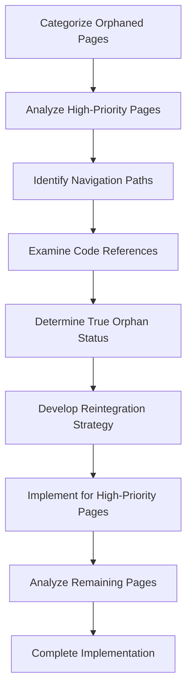
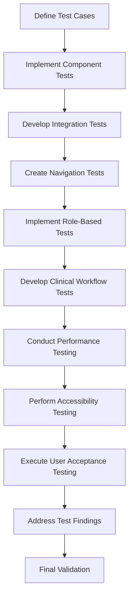
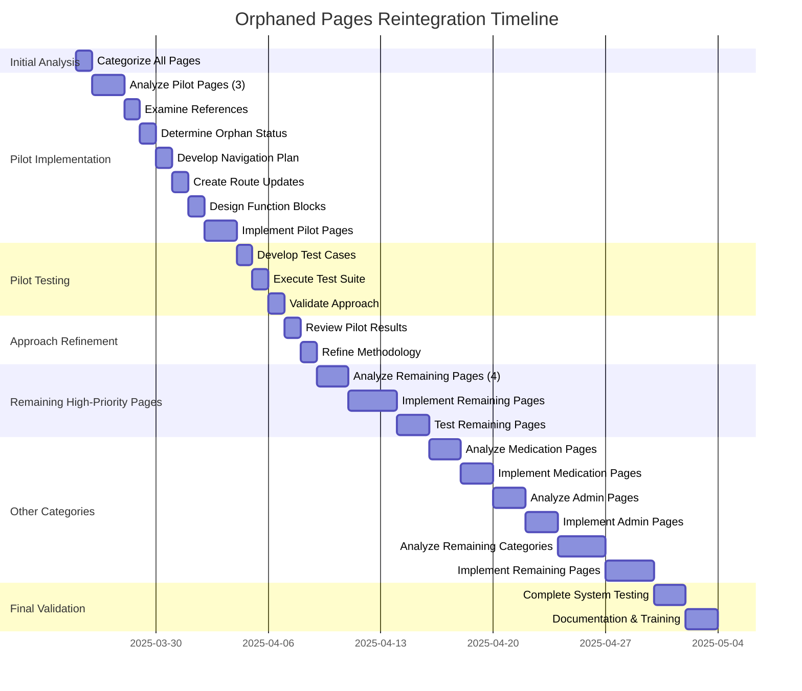

# Orphaned Pages Analysis and Reintegration Plan

## Executive Summary

This document outlines a comprehensive plan to analyze and reintegrate the 25 potentially orphaned pages identified in the OmniCare EMR system. The plan prioritizes clinical workflow pages that are most critical to users while providing a framework for addressing all orphaned pages.

## Prioritized Pages

Based on our analysis, we've identified the following high-priority clinical workflow pages:

1. CriticalResults
2. EmergencyCare
3. FluidBalance
4. TaskDetail
5. VisitNotes
6. PatientProfile
7. MedicalHistory

### Pilot Implementation Approach

To validate our approach before full implementation, we'll start with a pilot of 3 high-priority pages:

1. **CriticalResults** - Critical for patient safety and clinical decision-making
2. **FluidBalance** - Important for patient care monitoring
3. **PatientProfile** - Core to clinical workflows and patient information access

These pilot pages represent different aspects of clinical workflows and will allow us to validate our reintegration approach before scaling to all high-priority pages.

## Analysis and Reintegration Approach

### Phase 1: Categorization and Initial Analysis

All 25 orphaned pages will be categorized into functional groups:

1. **Clinical Workflow Pages (High Priority)**
   - CriticalResults
   - EmergencyCare
   - FluidBalance
   - TaskDetail
   - VisitNotes
   - PatientProfile
   - MedicalHistory

2. **Medication-Related Pages**
   - MedicationAdministration
   - MedicationView
   - Telemedicine

3. **Administrative Pages**
   - FunctionBlocks
   - RoleManagement

4. **Utility Pages**
   - Help
   - Index
   - PageNotFound
   - SectorSelection

5. **Authentication Pages**
   - Register
   - ResetPassword

6. **Content Pages**
   - Messages
   - Notifications
   - RecordView
   - Records
   - RxNormManagement
   - NewOrder
   - HospitalWorkflows

### Phase 2: High-Priority Page Analysis

For each high-priority clinical workflow page, we'll conduct a detailed analysis:

1. **Core Functionality**
   - Primary purpose and features
   - Component dependencies
   - API/data requirements

2. **Integration Points**
   - Parent/child component relationships
   - Service dependencies
   - Context usage

3. **UI/UX Considerations**
   - Layout structure
   - User interaction patterns
   - Accessibility features

### Phase 3: Navigation and Reference Analysis

For each high-priority page, we'll examine:

1. **Current Navigation Paths**
   - Sidebar configuration references
   - Direct links from other pages
   - Programmatic navigation

2. **Code References**
   - Import statements in other files
   - Component usage across the application
   - Dynamic references (e.g., lazy loading)

3. **Route Configuration**
   - Missing route definitions
   - Incorrect route paths
   - Permission/role issues

### Phase 4: True Orphan Status Determination

Based on the analysis, we'll classify each high-priority page as:

1. **True Orphan**: No references or navigation paths exist
2. **Partially Referenced**: Some references exist but are incomplete
3. **Hidden Dependency**: Referenced indirectly or dynamically
4. **Intentionally Isolated**: Designed to be accessed programmatically

### Phase 5: Reintegration Strategy Development

For high-priority clinical workflow pages, we'll develop:

1. **Navigation Integration Plan**
   - Sidebar menu placement
   - Breadcrumb integration
   - Related page links

2. **Route Configuration Updates**
   - New route definitions
   - Permission adjustments
   - Role-based access controls

3. **Function Block Integration**
   - Feature grouping
   - Permission mapping
   - Role assignment

### Phase 6: Implementation for High-Priority Pages

We'll implement the reintegration strategy for high-priority pages:

1. Update route configurations
2. Integrate with sidebar navigation
3. Add function block definitions
4. Test navigation and permissions

### Phase 7: Analysis of Remaining Pages

After completing the high-priority pages, we'll apply the same analysis and reintegration process to the remaining orphaned pages, grouped by category.

### Phase 8: Comprehensive Testing Strategy

To ensure the reintegrated pages work properly with the rest of the system, we'll implement a multi-layered testing approach:

#### Component Testing

For each reintegrated page:

- **Unit Tests**: Verify individual components render correctly
- **Props Validation**: Ensure components handle all expected props
- **State Management**: Test state updates and side effects
- **Error Handling**: Validate error boundaries and fallback behavior

#### Integration Testing

For page interactions with the system:

- **API Integration**: Verify data fetching and submission
- **Context Integration**: Test interaction with application contexts (Auth, Patient, etc.)
- **Service Integration**: Validate service calls and responses
- **Event Handling**: Test event propagation between components

#### Navigation Testing

For route configuration and navigation:

- **Route Accessibility**: Verify routes are accessible with proper permissions
- **URL Parameters**: Test handling of route parameters
- **Breadcrumb Integration**: Validate breadcrumb generation
- **Deep Linking**: Test direct URL access to pages
- **Navigation Flow**: Verify expected navigation paths between pages

#### Role-Based Access Testing

For permission and role validation:

- **Permission Checks**: Verify permission-based content rendering
- **Role Restrictions**: Test role-based access controls
- **Function Block Access**: Validate function block integration
- **UI Adaptation**: Ensure UI elements adapt to user permissions

#### Clinical Workflow Testing

For clinical functionality:

- **Workflow Scenarios**: Test end-to-end clinical workflows
- **Data Consistency**: Verify patient data consistency across pages
- **Clinical Decision Support**: Test any clinical decision support features
- **Documentation Flow**: Validate clinical documentation processes

#### Performance and Accessibility Testing

For quality assurance:

- **Load Time**: Measure and optimize page load performance
- **Rendering Performance**: Test rendering with large datasets
- **Accessibility Compliance**: Verify WCAG 2.1 AA compliance
- **Responsive Design**: Test across different screen sizes

#### User Acceptance Testing

For clinical staff validation:

- **Clinician Feedback**: Gather feedback from clinical users
- **Workflow Efficiency**: Measure task completion time
- **Usability Testing**: Conduct usability sessions with clinical staff
- **Feature Discoverability**: Test if users can find reintegrated features

#### Testing Implementation Plan

For each high-priority page, we'll create a test plan document that includes:

1. **Test Case Matrix**: Detailed test cases covering all testing layers
2. **Expected Results**: Clear definition of expected behavior
3. **Test Data Requirements**: Sample data needed for testing
4. **Testing Environment**: Configuration for test environments
5. **Regression Test Plan**: Strategy to prevent regressions

## Implementation Timeline

## Deliverables

1. **High-Priority Pages Analysis Document**
   - Detailed analysis of each high-priority clinical workflow page
   - Categorization and functionality assessment
   - Reference and dependency mapping

2. **High-Priority Reintegration Strategy**
   - Navigation pathways for each clinical workflow page
   - Route configuration updates
   - Function block integration plan

3. **Complete Analysis Document**
   - Analysis of all 25 orphaned pages
   - Categorization and recommendations for each page
   - Dependency and reference mapping

4. **Implementation Guide**
   - Step-by-step implementation instructions
   - Code snippets for route and navigation updates
   - Testing procedures

5. **Comprehensive Test Plans**
   - Detailed test cases for each reintegrated page
   - Test automation scripts
   - Testing environment configurations
   - Regression test strategy

6. **Training Materials**
   - Documentation for clinical staff
   - Navigation guides for new pathways
   - Feature overview for reintegrated pages

## Next Steps

1. Begin categorization of all 25 orphaned pages
2. **Pilot Phase**:
   - Conduct detailed analysis of the 3 pilot pages (CriticalResults, FluidBalance, PatientProfile)
   - Develop reintegration strategy for pilot pages
   - Create comprehensive test plans for pilot pages
   - Implement and test pilot page reintegration
   - Review results and refine approach
3. **Scaling Phase**:
   - Apply refined approach to remaining 4 high-priority pages
   - Implement and test remaining high-priority pages
4. **Completion Phase**:
   - Analyze and implement remaining page categories based on lessons learned
   - Conduct final system validation